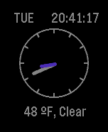

# Pebble JS Watchface

These are my edits to the stock Pebble JS watchface template.

I've added:
- Digital time printout
- Hour ticks on the clockface
- Day of the week
- Changed formatting

## Watchface Example

## License

This example is licensed under the [MIT License](./LICENSE).

## Notes

There's evidently not support for battery status in the JS Pebble SDK.
If you build this, you'll need to get your own API key for the weather status. You can sign up for free and get an API key [openweathermap.org](https://home.openweathermap.org "here.")
